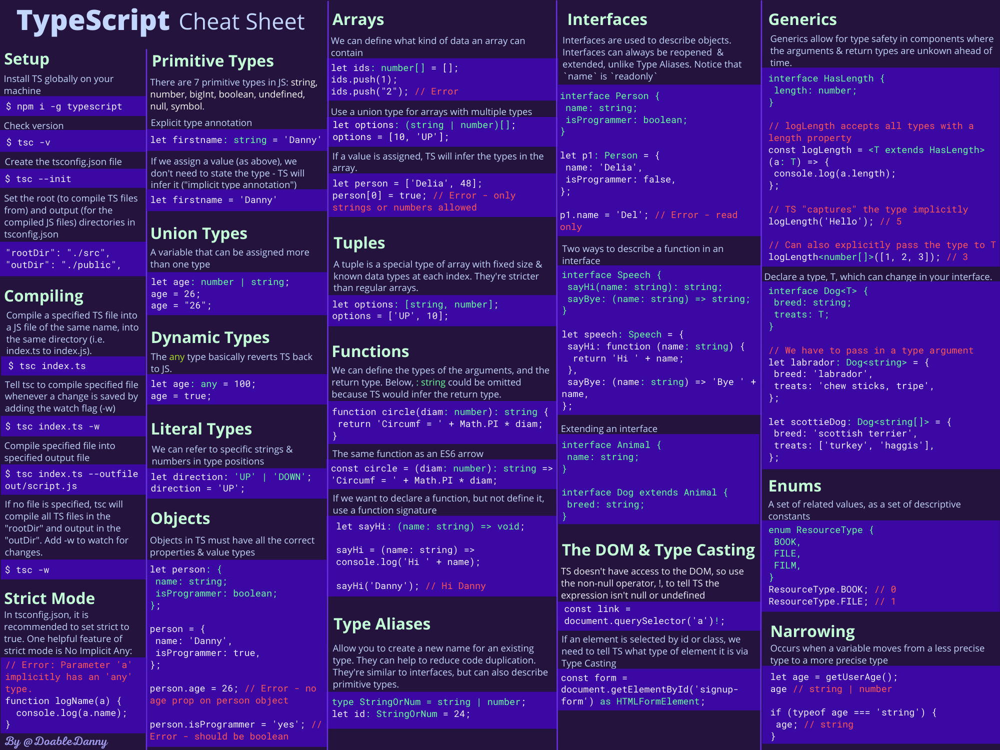

# TypeScript
TypeScript is the modification of JavaScript which protects us from most of of type bugs.

# Cheat sheet


*[Article](https://habr.com/ru/articles/663964/)*

## Installation and basic using
```bash
npm i -g typescript

tsc file.ts # compile TS file to JS with the same name
tsc file.ts -w # Compile file weather it is changed

# In working folder
tsc --init # Create file tsconfig.json (with big description)
tsc [-w] # Run compiler using config file
```

`tsc` will compile file even though it contains red errors. So, all error messages only can attract attention.

## Primitive types
Simple types: `string`, `number`, `bigInt`, `boolean`, `undefined`, `null`, `symbol`

`any` is a specific type primitive which allow use any type (aka simple JS)

**Variable cannot change its type after declaration**

```ts
var name1: type;
var name2: type1 | type2; // this var can contain either type1 value either type2
```

## Link types
Link types: array, `object`, functions, etc.

Arrays:
```ts
var intArr: number[];
var boolStrArr: (boolean | string)[];
var objArr: object[]; // Any object with any signature can be in arr
```

In TS we can declare **tuples**. It's array with fixed length and type for all cells:
```ts
var t: [boolean | number, string] = [1, 'Foo'];
t[0] = true; // OK
t[0] = '1'; // ERROR
t.push('5'); // Will work, but is's a bad practice
```

Objects in TS must have implementation for all their fields. We can declare object in implementation moment or create the interface:
```ts
var car: {
  name: string;
  velocity: number;
} = {
  name: "One",
  velocity: 100
};

// OR

interface Car {
  name: string;
  velocity: number;
}

var car1: Car = {
  name: "One",
  velocity: 100
};
```

### Functions
Functions' types can be declared by classical standard or using arrow. 

For function we can declare args types and return type (*also TS can detect these types automatically*)

Return type `void` means that function returns nothing

`?` after arg name means that this argument can be excluded

Example
```ts
function sayHi(name: string): string {
  return `Hi, ${name}`;
}

var goodBye = (name: string): string => `Goodbye, ${name}`;

interface HiBye {
  // In declarations we need to name args, but their names aren't important
  hiFunc(nameArg: string): string,
  byeFunc : (otherNameArg: string) => string
}

var hiByeObj : HiBye = {
  hiFunc: sayHi,
  byeFunc: goodBye
}

console.log(hiByeObj.hiFunc('Kirill')); // "Hi, Kirill"
console.log(hiByeObj.byeFunc('Den')); // "Goodbye, Den"

// Also we can implement function after declaration using the same signature
hiByeObj.byeFunc = (name) => "BYYYE"

console.log(hiByeObj.byeFunc('Den')); // "BYYYE"
```

---

We can give special names to complex types:
```ts
type ownType = number | string;
var v: ownType;
v = 5; // OK
v = 'five'; // OK
v = true; // ERROR

// Also we can use type instead of interface
type CarType = {
  name: string;
  velocity: number;
}
```

## DOM-object
TS doesn't know information about real DOM (only types).

So, we need to use `!` after function to mark that return type cannot be `null` and `as type` after function to say that return type will `type`.